# INTRODUCTION

Employee attrition is a critical challenge faced by many organizations today, as it directly affects productivity, morale, and overall business performance. Understanding the factors driving employee turnover is essential for organizations seeking to build a stable and motivated workforce.

In this project, I conducted a comprehensive Employee Attrition Analysis to uncover key trends, patterns, and insights from workforce data. The goal was to identify the major contributors to employee turnover and provide actionable recommendations that can help improve retention strategies and strengthen organizational performance.

Using Microsoft Excel, I analyzed employee demographics, job satisfaction levels, performance metrics, departmental structures, and compensation data. Through this analysis, I was able to determine which employee groups were most affected by attrition, understand the underlying causes, and highlight actionable areas for improvement.

The findings from this analysis provide a data-driven understanding of how factors such as age, gender, job role, marital status, income level, and job satisfaction influence attrition rates. These insights serve as a foundation for designing targeted retention initiatives and creating a more supportive and engaging work environment.

This project not only strengthened my analytical and storytelling skills but also demonstrated the power of data in driving strategic HR decisions.

## DATA OVERVIEW

The HR Attrition Dataset used for this project consists of 1,470 records and 35 columns, providing a comprehensive overview of the organization’s workforce. Each record represents an employee, capturing essential demographic, professional, and satisfaction-related information.

Key features include variables such as Employee Number, Age, Gender, Department, Marital Status, Job Involvement, Satisfaction Levels, Monthly Income, and Career Tenure (e.g., Years in Current Role and Years Since Last Promotion).

The most critical variable, “Attrition”, is a categorical field labeled as “Yes” or “No”, indicating whether an employee has left the company or remains employed. This serves as the foundation for exploring and interpreting attrition trends across different dimensions of the dataset.

By combining demographic, behavioral, and performance metrics, this dataset enables an in-depth exploration of the drivers of employee turnover and offers valuable insights into how personal and professional factors shape the overall employee experience.

## DATA CLEANING PROCESS

The first step in this project involved data cleaning, a crucial process to ensure the accuracy, reliability, and consistency of the dataset before analysis. Proper data preparation minimizes potential biases and improves the quality of insights derived from the analysis.

To achieve this, several key actions were performed, including sorting, removing duplicate entries, checking for missing values, validating data types, and ensuring that each column contained accurate and meaningful information.

1. Data Importation

The dataset, originally in CSV format, was imported into Microsoft Excel through the Data ribbon. After importing, it was converted into an Excel workbook format (.xlsx) to enable efficient data manipulation, cleaning, and analysis.

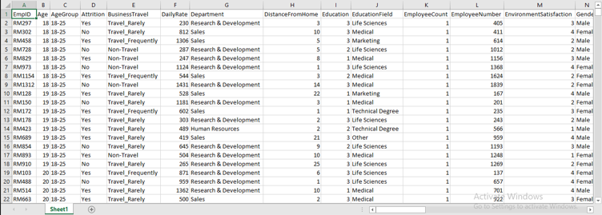

2. Removing Duplicates

To maintain data integrity and avoid distortion in the analysis results, I used the Remove Duplicates feature on the Data ribbon to identify and eliminate redundant entries.
During this process, 7 duplicate records were detected and removed, ensuring that each employee record in the dataset was unique.

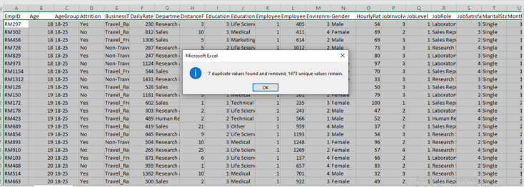

3. Column Validation and Data Type Checking

Each column in the dataset was thoroughly reviewed to verify accuracy and consistency. I applied filters across all columns to check for:

Missing values

Outliers or irregular entries

Incorrect data types

The dataset was confirmed to be clean, with no missing values or extreme outliers detected. Data types (numeric, text, categorical) were also validated to align with the nature of each variable.

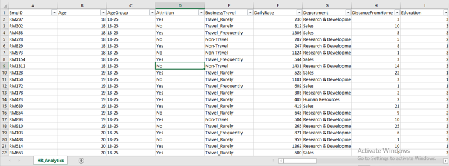

4. Replacing Encoded Values

In some instances, categorical data was encoded numerically. For example, the JobRole column contained numeric values (1–4), which represented specific job roles according to the dataset’s documentation. These numeric codes were replaced with their corresponding job titles to improve readability and facilitate accurate analysis.

**Job Satisfaction**

1 = very dissatisfied

2 = dissatisfied

3 = satisfied

4 = very satisfied

**Environment Satisfaction**

1 = Low

2 = Medium

3 = High

4 = Very High

**Education Level**

1 = High School

2 = Associate

3 = Bachelor's degree

4 = Master's degree

5 = Doctorate degree

## DATA ANALYSIS

### BUSINESS QUESTIONS

To further answer the pending questions on employee attrition, the following answers were provided.

Total Employees:
Used the COUNT function — =COUNT(K2:K1474) → 1,473 employees

Active Employees:
Used the COUNTIF function — =COUNTIF(D2:D1474, "=No") → 1,236 employees

Attrition Employees:
Used the COUNTIF function — =COUNTIF(D2:D1474, "=Yes") → 237 employees

Attrition Rate:
Calculated using =(Attrition Employees / Total Employees) * 100 → 16%

Attrition by Gender:

Female Employees: =COUNTIFS(D2:D1474, "=Yes", N2:N1474, "=Female") → 87

Male Employees: =COUNTIFS(D2:D1474, "=Yes", N2:N1474, "=Male") → 150

Average Age:
Used the AVERAGE function — =AVERAGE(B2:B1474) → 37 years

Average Salary:
Used the AVERAGE function — =AVERAGE(U2:U1474) → $6,500.00

## PIVOT TABLE

Data Exploration and Visualization

To uncover meaningful insights from the dataset, a series of visualizations were created using Microsoft Excel. These charts provide a clear and comprehensive view of how different demographic and professional factors influence employee attrition within the organization.

1. Attrition by Education

A doughnut chart was used to effectively illustrate the proportion of employee attrition across various education categories.
This visualization highlights how educational qualifications may influence employees’ decisions to stay or leave the organization.

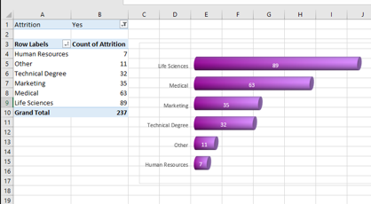

2. Attrition by Age Group and Gender

A stacked column chart was utilized to compare attrition trends across different age groups and genders.
This visualization helps identify which age brackets and gender groups experience the highest turnover, providing valuable insights for targeted retention efforts.

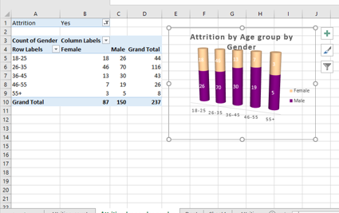

3. Attrition by Years at Company

An area chart was created to show the relationship between employee tenure and attrition rate.
The chart provides a clear view of how the number of years an employee has spent in the company impacts their likelihood of leaving.

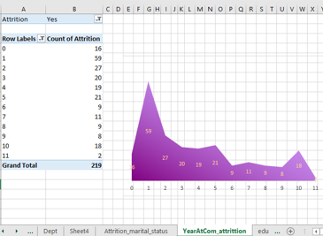

4. Attrition by Marital Status

A pie chart was used to illustrate the proportions of attrition across different marital status categories.
This chart highlights how personal circumstances, such as being single, married, or divorced, may influence employee turnover.

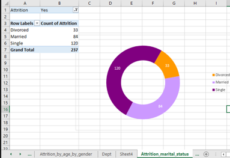

5. Attrition by Job Satisfaction

A stacked line chart was used to analyze attrition in relation to employee job satisfaction levels.
This visualization provides insights into how satisfaction levels correlate with attrition, helping to identify whether lower satisfaction leads to higher turnover.

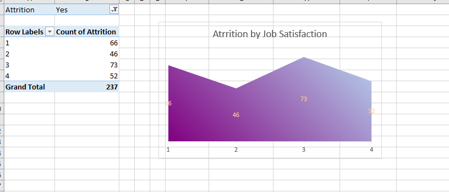

6. Attrition by Education Level

Another doughnut chart was used to examine attrition rates across various education levels.
This chart provides a quick comparison of how education attainment impacts employees’ retention or decision to leave the organization.

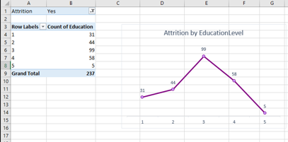

7. Attrition by Job Level

A line chart was used to show how job level correlates with attrition rates.
This visualization helps in understanding whether employees at lower or higher job levels are more likely to leave the organization.

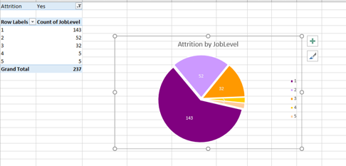

8. Attrition by Salary

A bar chart was created to compare attrition rates across different salary ranges.
The visualization clearly shows how compensation influences employee turnover, revealing whether lower-income groups are more likely to leave the organization.

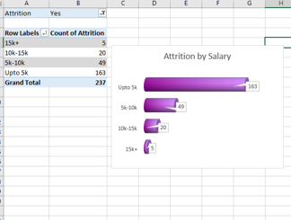

9. Attrition by Department

A pie chart was used to illustrate attrition proportions across the organization’s various departments.
This visualization identifies which departments experience the highest turnover, enabling management to focus on areas that require better retention strategies.

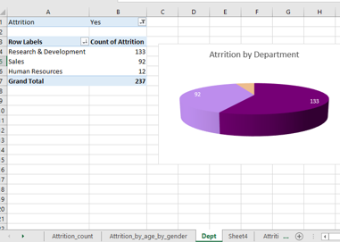

## INSIGHTS
Key Insights from the Employee Attrition Analysis

The organization has a total of 1,473 employees with an overall attrition rate of 16%.

Male employees accounted for the majority of attrition, representing 63% of total exits.

Interestingly, employees who reported being satisfied with their jobs (73 individuals) still chose to leave, suggesting other influencing factors beyond job satisfaction.

The 26–37 age group experienced the highest attrition, with 116 employees leaving the organization.

Single employees had the highest attrition rate at 51%, followed by married employees (35%) and divorced employees (14%).

The Research & Development department recorded the highest attrition rate at 56%, followed by Human Resources (39%) and Sales (5%).

Employees earning up to ₦5,000 monthly had the highest attrition count (163 employees), indicating a possible link between compensation and retention.

Entry-level employees faced the highest turnover, while senior-level employees showed the lowest attrition.

Employees with low environmental satisfaction were more likely to leave, emphasizing the importance of a positive and supportive workplace culture.

Employees holding a Bachelor’s degree had the highest attrition count (99 employees).

## RECOMMENDATIONS

Review Compensation Structures: Reassess salary scales, especially for lower-income earners, to ensure competitive pay and reduce financial dissatisfaction.

Enhance Employee Engagement: Investigate reasons behind attrition among satisfied employees—factors such as career growth, recognition, or work-life balance may be contributing.

Focus on Career Development: Provide mentorship and growth opportunities for entry-level employees to improve retention and career satisfaction.

Support Work-Life Balance: Introduce flexible policies that address the needs of younger and single employees, who form the largest group leaving the company.

Strengthen Departmental Retention Strategies: Conduct deeper analysis within R&D and HR departments to identify role-specific or managerial issues causing higher turnover.

Improve Workplace Environment: Enhance physical and cultural aspects of the work environment to boost overall employee satisfaction.

Targeted Retention Programs: Develop tailored initiatives for employees aged 26–37, as they represent a critical talent group with high attrition potential.

Enhance Retention Strategies: Focus on developing tailored retention programs, especially for younger and entry-level employees.

Review Compensation Structure: Reassess salary scales and benefits, particularly for employees earning below $5,000 monthly.

Improve Work Environment: Conduct regular surveys to identify environmental concerns and take actionable steps to boost satisfaction and engagement.

Strengthen Career Development: Offer growth opportunities, mentorship programs, and clear promotion pathways to reduce turnover among ambitious professionals.

Targeted Support for R&D Department: Investigate the root causes of high attrition in Research & Development and implement targeted retention initiatives.

